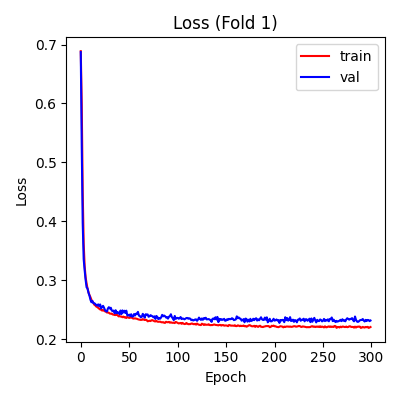
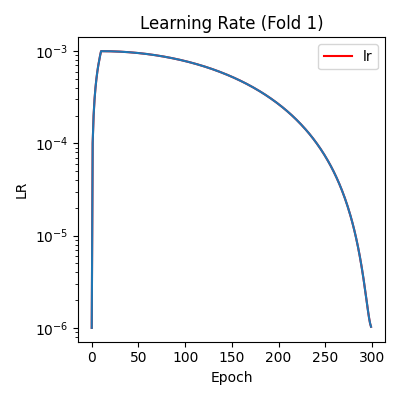

[TKV_AutoQC_README.md](https://github.com/user-attachments/files/26754267/TKV_AutoQC_README.md)
# TKV AutoQC
Automated Quality Control System for Kidney MRI Segmentation and Volume Calculation

TKV AutoQC is a modular deep-learning pipeline for automated Accept / Reject / Rework classification of MRI volumes used in Total Kidney Volume (TKV) workflows. It includes dataset curation, configurable preprocessing, single- and multi-input model training, inference, visualization, and experiment reproducibility. The system is designed for scalability across different 3D CNN and transformer architectures, and integrates seamlessly with an extended MultiImageNet framework developed within the Kline Lab.

## Features

**End-to-end QC pipeline:**
- Dataset curation from raw MRI + segmentation directories
- Automated stratified train/val/test split creation
- Flexible preprocessing (intensity, spatial, masking options)
- Support for both **single-input** and **multi-input** architectures
- Support for both binary and multiclass classification
- Config-driven training and inference

**Multiple backbones supported:**
- MONAI ResNet (18 → 152)
- DenseNet
- EfficientNet
- VGG16
- ViT
- Swin UNET-R
- MedicalNet ResNet18
- Multi-input architectures through **MultiImageNet** (referenced below)

**Outputs include:**
- Model prediction CSVs
- Confusion matrices
- TensorBoard logs
- Loss curves
- Timestamped experiment folders
- Full metrics + config snapshots

## Project Structure
```txt
dtcls_repo/
│── config/                     # YAML configs for preprocessing and model training
│── dataloader/                 # Dataloader scripts
│── documents/                  # Pipeline documentation
    │── TKV_AutoQC_README.md    # Project documentation (this file)
│── losses/                     # Loss functions
│── network_parameters/         # Network parameters for each model
|── networks/                   # Model definitions (ResNetClassifier, DenseNet, ViT, etc.)
│── utils/                      # Shared helper modules
│── weights/                    # Pretrained weights for MedicalNet ResNet18
│── scripts/                    # Environment setup, dataset preparation, and additional visualization utilities
```

**Installation**
1. Create and activate environment
```
conda create -n tkv_autoqc python=3.10
conda activate tkv_autoqc
```

2. Install dependencies
```
pip install -r requirements.txt
```

Dependencies include PyTorch, MONAI, NumPy, SciPy, SimpleITK, pandas,
scikit-learn, matplotlib, and additional scientific Python libraries
required for preprocessing, dataset construction, training, and visualization.

## Dataset Preparation

**Building Your Dataset**

TKV AutoQC provides tools to create stratified dataset splits.

Steps:
1. Place MRI volumes `*_0000.nii.gz` and corresponding segmentation masks `*.nii.gz` in unified directories. Scripts assume images are in Accept/Reject/Rework subdirectories and masks are in a single flat directory.
2. Filter dataset to check for images with labels touching the edge in any direction. This script will generate per-class information sheets with mask coverage data.
    - `CheckMask_FirstLastSlices_and_EdgeLabels.py`
3. Generate summary of cleaned dataset information and a clean file tracking sheet for data curation.
    - `GenerateSimplifiedCoverageSummary.py`
4. Run dataset curation script, with options to create a balanced train/val/test split or a balanced val/test split with the remaining images placed in the train dataset. It will output train/val/test file tracking logs.
    - `CurateStandardizedExperimentSet.py`
    
    Resulting directory:
```txt
dataset/stratified_split_v*/
├── train
│   ├── Accept/
│   ├── Reject/
│   └── Rework/
├── val
│   ├── Accept/
│   ├── Reject/
│   └── Rework/
└── test
    ├── Accept/
    ├── Reject/
    └── Rework/

```
3. Run Excel generation script to create the input files for the model. This script has tags to change the Excel format depending on which task the user wants to run (Acc/Rew vs Reject, Accept vs Rework, or multiclass). The output Excels meet the requirements outlined in the following section. 
    - `GenerateInputExcel_Flexible.py`


### Input Requirements
**Required Columns (all modes)**
| Column          | Description                                          |
| --------------- | ---------------------------------------------------- |
| **Names**       | Base filename of MRI                                 |
| **Directories** | Path to MRI file                                     |
| **Labels**      | Integer labels                                       |
| **Str_Label**   | Accept / Reject / Rework                             |
| **Seg_dirs**    | Path to segmentation mask file                       |

**Additional Columns for Multi-Input Mode**

Multi-input networks may consume multiple sequences or augmented versions simultaneously. The user will be required to specify the name of each input column and its corresponding segmentation directory (if applicable). These columns may be differentiated as `Directories_1`, `Directories_2`, `Seg_dirs_1`, `Seg_dirs_2`, etc. 

## Single-Input vs Multi-Input Pipelines

**Single-Input Pipeline**

Uses a single MRI volume + optional segmentation mask per sample.

**Multi-Input Pipeline (MultiImageNet)**

 - Consumes two or more correlated inputs processed in parallel.
 - Inputs are stacked or routed into separate network branches.
 
**Architecture**

Uses the **MultiImageNet** framework developed by **Mrinal K. Dhar.**

For full details of the MultiImageNet architecture, configuration, 
and multi-stream feature extraction, please refer to:
```
documents/model_multiImageNet.md
```

## Configuration-Driven Pipeline (YAML)
All preprocessing, model architecture, and training behavior is controlled via YAML configuration files. The YAML file serves as the primary pipeline interface.

### Model Configuration 
```
model:
  name: MedicalNetResNet18Classifier
  subname: resnet18
  in_channels: 1
  dropout: 0.0
  pretrained_path: /path/to/weights.pth
  freeze_backbone: true
  unfreeze_epoch: 100
  input_shape: [64, 128, 128]
```

Models are dynamically loaded using:
```
getattr(nets, config.model.name)
```
Feature dimensions are inferred automatically via a dummy forward pass.

### Training Configuration 
```
train:
  epochs: 300 
  backbone_lr: 0.005
  classifier_lr: 0.001
  optimizer: adamw      
  scheduler:
    type: cosine_warmup 
    warmup_epochs: 25
    min_lr: 1e-6
  weight_decay: 0.001
  save_weights_only: True
  save_best_model: True 
  save_last_model: True
  one_hot: False
  period: 20
  early_stop: False
  patience: 25
  batch_size: 16                
  n_classes: 1
  kfold: 5
  kfold_seed: 42 # random seed used to generate k-fold
  run_folds: [0] 
  retrain: 
    resume_train: False
    resume_folds: [1] # must be a list 
  device: cuda
```
- Optimizers, `adam`, `adamw`
- Schedulers: ReduceLROnPlateau, cosine_warmup, cosine_warmup_v2 (no base LR)
- `kfold` controls cross-validation folds; set to `null` or `1` to disable.
- `run_folds`: a list (e.g. [0,1] or null to run all folds)

### Dataset Inputs, Outputs, and Execution Phase

Dataset routing, Excel input files, output directories, and pipeline phase are all YAML-controlled.
No command-line arguments are required beyond specifying the config itself.

```yaml
directories:
  root: /scratch/abbydev/dtcls_repo_v2/
  excel_train_dir: /path/to/train.xlsx
  excel_test_dir: /path/to/val_or_test.xlsx
  result_dir: /path/to/output_directory/
```
- `phase`: controls whether to run training, testing, or both sequentially.
- All results (checkpoints, logs, CSVs, plots, TensorBoard summaries) are saved to timestamped subfolders under `result_dir`.

**Data Loading**
```
data:
  dataloader: loaderv5
  label_column: Labels
  dir_column: [Directories_1, Seg_dirs, Directories_2]
  mask_column: [null, null, Seg_dirs]
  binary_mask: [null, null, [1,2]]
  n_workers: 8
```
- `binary_mask`: if provided, the mask will be binarized with the labels given and multiplied with its corresponding entry in `dir_column`

**Excel column mapping:**
- Multi-Input Pipeline example
    ```
    dir_column: [Directories_1, Seg_dirs, Directories_2]
    mask_column: [null, null, Seg_dirs]
    binary_mask: [null, null, [1,2]]
    ```
    - Loads multiple correlated inputs per sample.
    - Channel order defines network input order
    - Lists can be reduced for single-input version.

### Preprocessing
Preprocessing occurs at runtime and is fully configurable.
```
data:
  resample: [5.0, null, null] 
  n_zSlices: 82
  zSlices_pad_value: 0
  clip: null
  clip_percentile: [0.5, 99]
  normalize: True
  resize: [128, 256, 256] # DHW
  resize_method: 'interpolation'
  resize_pad_value: 0
```

**Common Operations**
- Intensity clipping (absolute or percentile)
- Normalization
- Z-spacing resampling
- Depth padding/cropping
- Final spatial resizing
- Image × mask multiplication

### Augmentations
Augmentations are optional and flexible, pulling from both NumPy and MONAI libraries. They can be enabled directly in YAML:
```
transform:
  do_transform: True 
  transform_keys: ["transform1", "transform1", "transform1"]
  transform1:
      RandFlip:
        spatial_axis: 0
        prob: 0.5
      RandRotate:
        range_x: 0.25
        range_y: 0.25
        range_z: 0.25
        keep_size: True
        mode: nearest # bilinear
        prob: 0.5
      RandScaleIntensity:
        factors: [0.95, 1.05]
        prob: 0.5
      RandGaussianNoise:
        mean: 0.0
        std: 0.02
        prob: 0.5
      RandBiasField:
        coeff_range: [0.1, 0.3]
        prob: 0.5
      RandGaussianSmooth:
        sigma_x: [0.3, 0.3]
        sigma_y: [0.3, 0.3]
        sigma_z: [0.3, 0.3]
        prob: 0.5
        
  transform2: null
```
- `transform_keys`: allows user to specify which transform operations to perform on specific inputs

## Usage

### Training and Inference
To run single-input training, use the following command:
```
python trainer_BcMcc_v4.py --config config/example.yaml
```

To run multi-input training, use the following command:
```
python trainer_multiImageNet_v1.py --config configs/multi_input_example.yaml
```

- Training, inference, or both will run depending on which phase the user specifies in the YAML file.


## Example Outputs 

TKV AutoQC generates:
- Loss, learning rate, and accuracy curves
- Confusion matrices 
- CSV files with predicted labels and scores
- TensorBoard summaries

Example plots:




All results are written to timestamped folders under the folder specified in the YAML.
 
## FAQ 

**How do I change architectures?**

Modify the config:
```
model:
  name: ViTClassifier
```
or any supported model.

**How do I reduce overfitting?**

- Increase dropout
- Reduce model depth
- Data augmentation (intensity, spatial, etc.)

## Troubleshooting
- CUDA out of memory: Reduce batch size or number of workers.
- Shape mismatch: Verify the final tensor matches the expected shape.
- Segmentation not found: Check the directory columns in the source Excel file.

## Authorship & Credits

The core architecture and initial implementation of this pipeline were
developed by **Mrinal Kanti Dhar** (Kline Lab).

Subsequent features, adaptations, and extensions—including the multi-input
workflow, dataset preparation tools, QC-specific components, and
preprocessing options—have been developed collaboratively by
**Mrinal Dhar** and **Abigail Green**.

This repository continues to be maintained as a joint effort within the Kline Lab.

## License


## Citation

(Include once published.)

